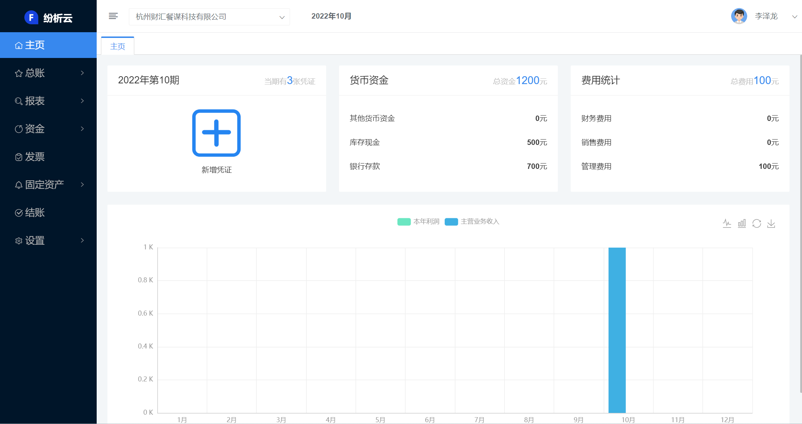

# 纷析云-财务系统

## 源码交流群

#### 预览环境
https://f.fenxi365.com/

账号：13456781004 / 密码：123456
#### 介绍
云财务软件

目前主要包括以下模块，凭证 账簿 报表 结账 设置

技术选型

1、后端

核心框架：Spring Boot

持久层框架：MyBatis

缓存框架：Redis

短信接口：阿里云

2、前端

前端框架：VUE.JS

3、平台

服务器中间件：SpringBoot

数据库支持：目前仅提供MySql数据库的支持，但不限于数据库

开发环境：Java、IDEA 、Gradle 、Git 、NODE.JS

4、版权说明

可以免费使用，不可用于商业销售
#### 商业版演示地址
https://f2.fenxi365.com/
账号：13456781004 / 密码：123456

